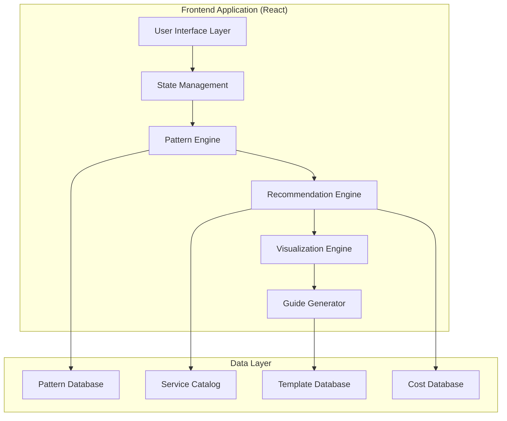

# AWS Deploy Assistant - MVP Core Design Document

## Overview

This design document outlines the technical architecture and implementation approach for the AWS Deploy Assistant MVP. The system will provide an intelligent, visual workflow for analyzing applications and generating AWS deployment recommendations with step-by-step guides.

## Architecture

### High-Level System Architecture



### Component Architecture

The application follows a modular, feature-based architecture with clear separation of concerns:

```
src/
├── components/
│   ├── core/                    # Reusable UI components
│   ├── analysis/               # Code analysis workflow
│   ├── recommendations/        # Service recommendations
│   ├── architecture/           # Diagram visualization
│   ├── deployment/            # Guide generation
│   └── cost/                  # Cost estimation
├── context/                   # State management
├── hooks/                     # Business logic hooks
├── utils/                     # Core algorithms
└── data/                      # Static data files
```

## Components and Interfaces

### 1. Core UI Components

#### Layout System
```javascript
// Layout.jsx - Main application shell
const Layout = ({ children }) => {
  return (
    <div className="min-h-screen bg-gray-50">
      <Header />
      <main className="container mx-auto px-4 py-8">
        {children}
      </main>
      <Footer />
    </div>
  );
};

// StepIndicator.jsx - Workflow progress
const StepIndicator = ({ steps, currentStep }) => {
  // Visual progress indicator with step validation
};
```

#### Form Components
```javascript
// Button.jsx - Consistent button styling
const Button = ({ 
  variant = 'primary', 
  size = 'md', 
  loading = false, 
  children, 
  ...props 
}) => {
  const baseClasses = 'font-semibold rounded-lg transition-colors';
  const variants = {
    primary: 'bg-blue-600 hover:bg-blue-700 text-white',
    secondary: 'bg-gray-200 hover:bg-gray-300 text-gray-900',
    success: 'bg-green-600 hover:bg-green-700 text-white'
  };
  // Implementation with loading states and accessibility
};

// Card.jsx - Content containers
const Card = ({ title, children, className = '' }) => {
  return (
    <div className={`bg-white rounded-xl shadow-lg border border-gray-200 ${className}`}>
      {title && (
        <div className="px-6 py-4 border-b border-gray-200">
          <h3 className="text-lg font-semibold text-gray-900">{title}</h3>
        </div>
      )}
      <div className="p-6">{children}</div>
    </div>
  );
};
```

### 2. Analysis Engine Components

#### Code Uploader
```javascript
// CodeUploader.jsx - File upload and text input
const CodeUploader = ({ onAnalyze }) => {
  const [input, setInput] = useState('');
  const [files, setFiles] = useState([]);
  const [analyzing, setAnalyzing] = useState(false);

  const handleFileUpload = (uploadedFiles) => {
    // Process package.json, source files, config files
    const processedFiles = uploadedFiles.map(file => ({
      name: file.name,
      content: file.content,
      type: getFileType(file.name),
      size: file.size
    }));
    setFiles(processedFiles);
  };

  const handleAnalyze = async () => {
    setAnalyzing(true);
    const analysisInput = {
      description: input,
      files: files,
      timestamp: new Date().toISOString()
    };
    
    const result = await analyzeApplication(analysisInput);
    onAnalyze(result);
    setAnalyzing(false);
  };

  return (
    <Card title="Describe Your Application">
      <FileDropZone onFilesUploaded={handleFileUpload} />
      <TextInput 
        value={input}
        onChange={setInput}
        placeholder="Describe your application..."
      />
      <ExamplePrompts onSelectExample={setInput} />
      <Button 
        onClick={handleAnalyze}
        loading={analyzing}
        disabled={!input.trim() && files.length === 0}
      >
        Analyze Application
      </Button>
    </Card>
  );
};
```

#### Pattern Detection Engine
```javascript
// PatternDetector.jsx - Core analysis logic
const PatternDetector = {
  analyzeApplication: (input) => {
    const detectors = [
      new FrameworkDetector(),
      new AppTypeDetector(),
      new InfrastructureDetector(),
      new DatabaseDetector()
    ];

    const results = detectors.map(detector => 
      detector.analyze(input)
    );

    return {
      detected: combineResults(results),
      confidence: calculateConfidence(results),
      alternatives: generateAlternatives(results),
      timestamp: new Date().toISOString()
    };
  }
};

class FrameworkDetector {
  analyze(input) {
    const patterns = {
      react: {
        files: ['package.json', /\.jsx?$/],
        dependencies: ['react', 'react-dom'],
        content: [/useState|useEffect/, /jsx/i, /React\./],
        weight: 0.9
      },
      vue: {
        files: ['package.json', /\.vue$/],
        dependencies: ['vue'],
        content: [/v-if|v-for/, /<template>/, /Vue\./],
        weight: 0.9
      },
      nodejs: {
        files: ['package.json', /server\.js|app\.js/],
        dependencies: ['express', 'fastify', 'koa'],
        content: [/app\.listen/, /require\(/, /module\.exports/],
        weight: 0.85
      }
    };

    return this.scorePatterns(patterns, input);
  }

  scorePatterns(patterns, input) {
    const scores = {};
    
    for (const [framework, pattern] of Object.entries(patterns)) {
      let score = 0;
      
      // File pattern matching
      const fileMatches = this.matchFiles(pattern.files, input.files);
      score += fileMatches * 0.3;
      
      // Dependency matching
      const depMatches = this.matchDependencies(pattern.dependencies, input);
      score += depMatches * 0.4;
      
      // Content pattern matching
      const contentMatches = this.matchContent(pattern.content, input);
      score += contentMatches * 0.3;
      
      scores[framework] = score * pattern.weight;
    }
    
    return this.selectBestMatch(scores);
  }
}
```

### 3. Recommendation Engine

#### Service Recommender
```javascript
// ServiceRecommender.jsx - AWS service selection logic
const ServiceRecommender = {
  generateRecommendations: (analysis, preferences = {}) => {
    const architecturePatterns = this.getArchitecturePatterns();
    const matchedPatterns = this.matchPatterns(analysis, architecturePatterns);
    
    return matchedPatterns.map(pattern => ({
      ...pattern,
      services: this.optimizeServices(pattern.services, preferences),
      cost: this.calculateCost(pattern.services, analysis.traffic),
      complexity: this.assessComplexity(pattern.services),
      deploymentTime: this.estimateDeploymentTime(pattern.services)
    }));
  },

  getArchitecturePatterns: () => ({
    'static-spa': {
      id: 'static-spa',
      name: 'Static SPA Hosting',
      description: 'Serverless hosting for React/Vue SPAs using S3 and CloudFront',
      conditions: {
        framework: ['react', 'vue', 'angular'],
        appType: 'spa',
        database: 'none',
        serverSide: false
      },
      services: [
        {
          service: 'S3',
          purpose: 'Static file hosting',
          required: true,
          config: {
            bucketPolicy: 'public-read',
            websiteHosting: true,
            indexDocument: 'index.html'
          }
        },
        {
          service: 'CloudFront',
          purpose: 'Global CDN and HTTPS',
          required: true,
          config: {
            originDomainName: '${S3_BUCKET}.s3-website-${REGION}.amazonaws.com',
            viewerProtocolPolicy: 'redirect-to-https'
          }
        },
        {
          service: 'Route53',
          purpose: 'Custom domain DNS',
          required: false,
          config: {
            recordType: 'ALIAS',
            target: '${CLOUDFRONT_DISTRIBUTION}'
          }
        }
      ],
      cost: { min: 5, max: 25, typical: 12 },
      complexity: 2,
      scalability: 5
    },

    'serverless-api': {
      id: 'serverless-api',
      name: 'Serverless API',
      description: 'Pay-per-request API using Lambda and API Gateway',
      conditions: {
        framework: ['nodejs', 'python'],
        appType: 'api',
        database: 'optional',
        realtime: false
      },
      services: [
        {
          service: 'Lambda',
          purpose: 'Serverless compute',
          required: true,
          config: {
            runtime: '${DETECTED_RUNTIME}',
            memorySize: 256,
            timeout: 30
          }
        },
        {
          service: 'API Gateway',
          purpose: 'HTTP API management',
          required: true,
          config: {
            type: 'REST',
            endpointType: 'REGIONAL',
            cors: true
          }
        },
        {
          service: 'DynamoDB',
          purpose: 'NoSQL database',
          required: false,
          config: {
            billingMode: 'PAY_PER_REQUEST',
            pointInTimeRecovery: true
          }
        }
      ],
      cost: { min: 10, max: 100, typical: 35 },
      complexity: 3,
      scalability: 5
    }
  }),

  matchPatterns: (analysis, patterns) => {
    const matches = [];
    
    for (const [id, pattern] of Object.entries(patterns)) {
      const score = this.calculatePatternScore(analysis, pattern);
      if (score > 0.6) {
        matches.push({ ...pattern, matchScore: score });
      }
    }
    
    return matches.sort((a, b) => b.matchScore - a.matchScore);
  }
};
```

### 4. Architecture Visualization

#### React Flow Integration
```javascript
// ArchitectureDiagram.jsx - Interactive architecture visualization
import ReactFlow, { 
  Background, 
  Controls, 
  MiniMap,
  useNodesState,
  useEdgesState 
} from 'reactflow';

const ArchitectureDiagram = ({ architecture, onServiceSelect }) => {
  const [nodes, setNodes, onNodesChange] = useNodesState([]);
  const [edges, setEdges, onEdgesChange] = useEdgesState([]);

  useEffect(() => {
    const { nodes: layoutNodes, edges: layoutEdges } = 
      generateDiagramLayout(architecture);
    setNodes(layoutNodes);
    setEdges(layoutEdges);
  }, [architecture]);

  const nodeTypes = {
    awsService: AWSServiceNode,
    userFlow: UserFlowNode,
    dataStore: DataStoreNode
  };

  const edgeTypes = {
    dataFlow: DataFlowEdge,
    apiCall: APICallEdge
  };

  return (
    <div className="h-96 border border-gray-300 rounded-lg">
      <ReactFlow
        nodes={nodes}
        edges={edges}
        onNodesChange={onNodesChange}
        onEdgesChange={onEdgesChange}
        nodeTypes={nodeTypes}
        edgeTypes={edgeTypes}
        fitView
      >
        <Background />
        <Controls />
        <MiniMap />
      </ReactFlow>
    </div>
  );
};

// AWSServiceNode.jsx - Custom node for AWS services
const AWSServiceNode = ({ data }) => {
  const { service, purpose, cost, selected } = data;
  
  return (
    <div className={`
      p-4 rounded-lg border-2 bg-white shadow-lg min-w-32
      ${selected ? 'border-blue-500 shadow-blue-200' : 'border-gray-300'}
    `}>
      <div className="flex items-center space-x-2 mb-2">
        
        <h4 className="font-semibold text-sm">{service}</h4>
      </div>
      <p className="text-xs text-gray-600 mb-1">{purpose}</p>
      <p className="text-xs text-green-600 font-medium">{cost}</p>
    </div>
  );
};
```

### 5. Deployment Guide Generator

#### Step-by-Step Guide
```javascript
// DeploymentGuide.jsx - Interactive deployment instructions
const DeploymentGuide = ({ architecture, onStepComplete }) => {
  const [currentStep, setCurrentStep] = useState(0);
  const [completedSteps, setCompletedSteps] = useState(new Set());
  
  const guide = generateDeploymentGuide(architecture);

  const handleStepComplete = (stepIndex) => {
    setCompletedSteps(prev => new Set([...prev, stepIndex]));
    onStepComplete(stepIndex);
  };

  return (
    <Card title={guide.title}>
      <div className="mb-6">
        <div className="flex items-center space-x-4 text-sm text-gray-600">
          <span>⏱️ {guide.estimatedTime}</span>
          <span>📋 {guide.steps.length} steps</span>
        </div>
      </div>

      <PrerequisiteChecker 
        prerequisites={guide.prerequisites}
        onAllMet={() => setCurrentStep(0)}
      />

      <div className="space-y-6">
        {guide.steps.map((step, index) => (
          <DeploymentStep
            key={index}
            step={step}
            index={index}
            isActive={currentStep === index}
            isCompleted={completedSteps.has(index)}
            onComplete={() => handleStepComplete(index)}
            onActivate={() => setCurrentStep(index)}
          />
        ))}
      </div>
    </Card>
  );
};

// DeploymentStep.jsx - Individual step component
const DeploymentStep = ({ step, index, isActive, isCompleted, onComplete, onActivate }) => {
  const [commandsCopied, setCommandsCopied] = useState(new Set());

  const copyCommand = (command, commandIndex) => {
    navigator.clipboard.writeText(command);
    setCommandsCopied(prev => new Set([...prev, commandIndex]));
    setTimeout(() => {
      setCommandsCopied(prev => {
        const newSet = new Set(prev);
        newSet.delete(commandIndex);
        return newSet;
      });
    }, 2000);
  };

  return (
    <div className={`
      border rounded-lg p-4 transition-all
      ${isActive ? 'border-blue-500 bg-blue-50' : 'border-gray-200'}
      ${isCompleted ? 'bg-green-50 border-green-300' : ''}
    `}>
      <div className="flex items-start justify-between mb-3">
        <div className="flex items-center space-x-3">
          <div className={`
            w-8 h-8 rounded-full flex items-center justify-center font-semibold text-sm
            ${isCompleted ? 'bg-green-500 text-white' : 
              isActive ? 'bg-blue-500 text-white' : 'bg-gray-200 text-gray-600'}
          `}>
            {isCompleted ? '✓' : index + 1}
          </div>
          <div>
            <h4 className="font-semibold text-gray-900">{step.title}</h4>
            <p className="text-sm text-gray-600">{step.description}</p>
          </div>
        </div>
        
        {!isCompleted && (
          <Button
            size="sm"
            variant={isActive ? "primary" : "secondary"}
            onClick={isActive ? onComplete : onActivate}
          >
            {isActive ? 'Mark Complete' : 'Start Step'}
          </Button>
        )}
      </div>

      {isActive && (
        <div className="ml-11 space-y-3">
          {step.commands && step.commands.length > 0 && (
            <div>
              <h5 className="font-medium text-gray-900 mb-2">Commands:</h5>
              <div className="space-y-2">
                {step.commands.map((command, cmdIndex) => (
                  <div key={cmdIndex} className="relative">
                    <pre className="bg-gray-900 text-green-400 p-3 rounded text-sm overflow-x-auto">
                      {command}
                    </pre>
                    <button
                      onClick={() => copyCommand(command, cmdIndex)}
                      className="absolute top-2 right-2 p-1 bg-gray-700 hover:bg-gray-600 rounded text-white"
                    >
                      {commandsCopied.has(cmdIndex) ? <Check size={16} /> : <Copy size={16} />}
                    </button>
                  </div>
                ))}
              </div>
            </div>
          )}
          
          {step.explanation && (
            <div className="bg-blue-50 border border-blue-200 rounded p-3">
              <p className="text-sm text-blue-800">{step.explanation}</p>
            </div>
          )}
        </div>
      )}
    </div>
  );
};
```

## Data Models

### Application Analysis Result
```javascript
const AnalysisResult = {
  id: 'uuid',
  timestamp: '2025-08-17T10:30:00Z',
  input: {
    type: 'code_upload' | 'description',
    description: 'React e-commerce app with shopping cart...',
    files: [
      {
        name: 'package.json',
        content: '{"dependencies": {"react": "^18.0.0"}}',
        type: 'config',
        size: 1024
      }
    ]
  },
  detected: {
    framework: 'react',
    appType: 'spa',
    database: 'none',
    auth: false,
    realtime: false,
    storage: false,
    expectedTraffic: 'low',
    complexity: 2,
    confidence: 0.89
  },
  recommendations: [
    {
      id: 'static-spa',
      matchScore: 0.95,
      architecture: ArchitectureRecommendation
    }
  ]
};
```

### Architecture Recommendation
```javascript
const ArchitectureRecommendation = {
  id: 'static-spa',
  name: 'Static SPA Hosting',
  description: 'Serverless hosting for React SPAs using S3 and CloudFront',
  services: [
    {
      service: 'S3',
      purpose: 'Static file hosting',
      category: 'storage',
      required: true,
      config: {
        bucketPolicy: 'public-read',
        websiteHosting: true,
        indexDocument: 'index.html',
        errorDocument: 'error.html'
      },
      pricing: {
        model: 'storage + requests',
        storage: '$0.023/GB/month',
        requests: '$0.0004/1000 GET requests',
        freeTier: '5GB storage, 20k GET requests'
      },
      setupComplexity: 2,
      icon: 'database'
    }
  ],
  architecture: {
    type: 'serverless',
    complexity: 2,
    scalability: 5,
    maintainability: 4
  },
  cost: {
    monthly: { min: 5, max: 25, typical: 12 },
    trafficBased: true,
    freeTierEligible: true,
    breakdown: [
      { service: 'S3', cost: '$2-8', description: 'Storage and requests' },
      { service: 'CloudFront', cost: '$1-10', description: 'CDN delivery' },
      { service: 'Route53', cost: '$0.50', description: 'DNS hosting' }
    ]
  },
  deployment: {
    steps: [DeploymentStep],
    estimatedTime: '20 minutes',
    prerequisites: ['AWS CLI', 'Node.js'],
    difficulty: 'beginner'
  }
};
```

### Deployment Guide Structure
```javascript
const DeploymentGuide = {
  id: 'static-spa-guide',
  title: 'Deploy React SPA to AWS S3 + CloudFront',
  estimatedTime: '20 minutes',
  difficulty: 'beginner',
  prerequisites: [
    {
      name: 'AWS CLI',
      description: 'Command line interface for AWS',
      installUrl: 'https://aws.amazon.com/cli/',
      checkCommand: 'aws --version',
      required: true
    },
    {
      name: 'Node.js',
      description: 'JavaScript runtime for building the app',
      installUrl: 'https://nodejs.org/',
      checkCommand: 'node --version',
      required: true
    }
  ],
  steps: [
    {
      id: 'build-app',
      title: 'Build your React application',
      description: 'Create production build of your React app',
      commands: [
        'npm install',
        'npm run build'
      ],
      explanation: 'This creates optimized static files in the build/ directory',
      estimatedTime: '2-5 minutes',
      troubleshooting: [
        {
          issue: 'Build fails with memory error',
          solution: 'Try: NODE_OPTIONS="--max-old-space-size=4096" npm run build'
        }
      ]
    }
  ],
  validation: {
    finalTest: 'curl -I https://your-domain.com',
    expectedResult: 'HTTP/1.1 200 OK',
    troubleshootingUrl: 'https://docs.aws.amazon.com/s3/latest/userguide/troubleshooting.html'
  }
};
```

## Error Handling

### Error Categories and Handling Strategy

#### 1. User Input Errors
```javascript
const InputErrorHandler = {
  validateFileUpload: (files) => {
    const errors = [];
    
    files.forEach(file => {
      if (file.size > 10 * 1024 * 1024) { // 10MB limit
        errors.push({
          type: 'FILE_TOO_LARGE',
          message: `File ${file.name} exceeds 10MB limit`,
          file: file.name
        });
      }
      
      if (!this.isSupportedFileType(file.name)) {
        errors.push({
          type: 'UNSUPPORTED_FILE_TYPE',
          message: `File type not supported: ${file.name}`,
          file: file.name
        });
      }
    });
    
    return errors;
  },

  validateDescription: (description) => {
    if (description.length < 10) {
      return {
        type: 'DESCRIPTION_TOO_SHORT',
        message: 'Please provide more details about your application'
      };
    }
    return null;
  }
};
```

#### 2. Analysis Errors
```javascript
const AnalysisErrorHandler = {
  handleLowConfidence: (analysis) => {
    if (analysis.confidence < 0.7) {
      return {
        type: 'LOW_CONFIDENCE',
        message: 'Unable to confidently detect your application pattern',
        suggestions: [
          'Try uploading your package.json file',
          'Provide more details in the description',
          'Select your framework manually'
        ],
        fallbackOptions: this.getManualSelectionOptions()
      };
    }
    return null;
  },

  handleConflictingPatterns: (patterns) => {
    if (patterns.length > 1 && patterns[0].score - patterns[1].score < 0.2) {
      return {
        type: 'CONFLICTING_PATTERNS',
        message: 'Multiple application patterns detected',
        options: patterns.map(p => ({
          name: p.name,
          confidence: p.score,
          description: p.description
        }))
      };
    }
    return null;
  }
};
```

#### 3. System Errors
```javascript
// ErrorBoundary.jsx - React error boundary
class AnalysisErrorBoundary extends Component {
  constructor(props) {
    super(props);
    this.state = { hasError: false, error: null, errorInfo: null };
  }

  static getDerivedStateFromError(error) {
    return { hasError: true };
  }

  componentDidCatch(error, errorInfo) {
    this.setState({
      error: error,
      errorInfo: errorInfo
    });
    
    // Log error for debugging
    console.error('Analysis Error:', error, errorInfo);
  }

  render() {
    if (this.state.hasError) {
      return (
        <ErrorFallback 
          error={this.state.error}
          onRetry={() => this.setState({ hasError: false, error: null })}
        />
      );
    }
    
    return this.props.children;
  }
}

const ErrorFallback = ({ error, onRetry }) => (
  <Card title="Something went wrong">
    <div className="text-center py-8">
      <AlertCircle className="mx-auto mb-4 text-red-500" size={48} />
      <h3 className="text-lg font-semibold text-gray-900 mb-2">
        Analysis Failed
      </h3>
      <p className="text-gray-600 mb-4">
        We encountered an error while analyzing your application.
      </p>
      <Button onClick={onRetry}>
        Try Again
      </Button>
    </div>
  </Card>
);
```

## Testing Strategy

### Unit Testing Approach
```javascript
// Pattern matching tests
describe('PatternDetector', () => {
  test('detects React SPA correctly', () => {
    const input = {
      files: [
        { name: 'package.json', content: '{"dependencies": {"react": "^18.0.0"}}' },
        { name: 'src/App.jsx', content: 'import React from "react"' }
      ],
      description: 'React shopping cart application'
    };
    
    const result = PatternDetector.analyzeApplication(input);
    
    expect(result.detected.framework).toBe('react');
    expect(result.detected.appType).toBe('spa');
    expect(result.confidence).toBeGreaterThan(0.8);
  });

  test('handles low confidence gracefully', () => {
    const input = {
      files: [],
      description: 'some app'
    };
    
    const result = PatternDetector.analyzeApplication(input);
    
    expect(result.confidence).toBeLessThan(0.7);
    expect(result.alternatives).toBeDefined();
  });
});

// Cost calculation tests
describe('CostCalculator', () => {
  test('calculates S3 costs accurately', () => {
    const architecture = architecturePatterns['static-spa'];
    const traffic = { pageviews: 10000, dataTransfer: 5 }; // GB
    
    const cost = CostCalculator.calculate(architecture, traffic);
    
    expect(cost.monthly.typical).toBeCloseTo(12, 1);
    expect(cost.freeTierEligible).toBe(true);
  });
});
```

### Integration Testing
```javascript
// End-to-end workflow tests
describe('Deployment Workflow', () => {
  test('completes full analysis to guide workflow', async () => {
    const { render, screen, user } = renderWithProviders(<App />);
    
    // Upload code
    const fileInput = screen.getByLabelText(/upload files/i);
    await user.upload(fileInput, mockReactFiles);
    
    // Analyze
    const analyzeButton = screen.getByRole('button', { name: /analyze/i });
    await user.click(analyzeButton);
    
    // Verify recommendations appear
    await screen.findByText(/static spa hosting/i);
    
    // Select architecture
    const selectButton = screen.getByRole('button', { name: /select architecture/i });
    await user.click(selectButton);
    
    // Verify deployment guide appears
    await screen.findByText(/deployment guide/i);
    
    expect(screen.getByText(/build your react application/i)).toBeInTheDocument();
  });
});
```

## Performance Considerations

### Bundle Size Optimization
```javascript
// Lazy loading for heavy components
const ArchitectureDiagram = lazy(() => import('./components/architecture/ArchitectureDiagram'));
const DeploymentGuide = lazy(() => import('./components/deployment/DeploymentGuide'));

// Code splitting by route/feature
const App = () => (
  <Router>
    <Routes>
      <Route path="/" element={
        <Suspense fallback={<LoadingSpinner />}>
          <AnalysisWorkflow />
        </Suspense>
      } />
    </Routes>
  </Router>
);

// Memoization for expensive calculations
const useMemoizedRecommendations = (analysis, preferences) => {
  return useMemo(() => {
    if (!analysis) return [];
    return ServiceRecommender.generateRecommendations(analysis, preferences);
  }, [analysis, preferences]);
};
```

### Rendering Performance
```javascript
// Virtual scrolling for large lists
const ServiceList = ({ services }) => {
  const [visibleRange, setVisibleRange] = useState({ start: 0, end: 10 });
  
  const visibleServices = services.slice(visibleRange.start, visibleRange.end);
  
  return (
    <div className="h-96 overflow-y-auto" onScroll={handleScroll}>
      {visibleServices.map(service => (
        <ServiceCard key={service.id} service={service} />
      ))}
    </div>
  );
};

// Debounced analysis to prevent excessive re-computation
const useDebounceAnalysis = (input, delay = 500) => {
  const [debouncedInput, setDebouncedInput] = useState(input);
  
  useEffect(() => {
    const timer = setTimeout(() => setDebouncedInput(input), delay);
    return () => clearTimeout(timer);
  }, [input, delay]);
  
  return debouncedInput;
};
```

---

This design document provides a comprehensive technical blueprint for implementing the AWS Deploy Assistant MVP, ensuring scalable architecture, robust error handling, and optimal performance while maintaining the user experience goals outlined in the requirements.